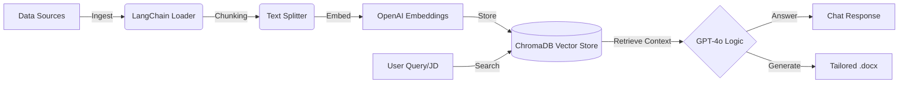
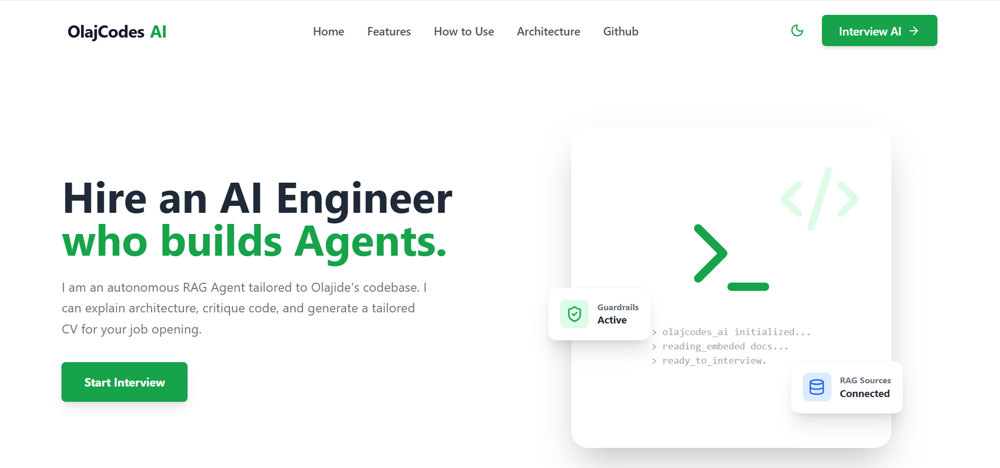
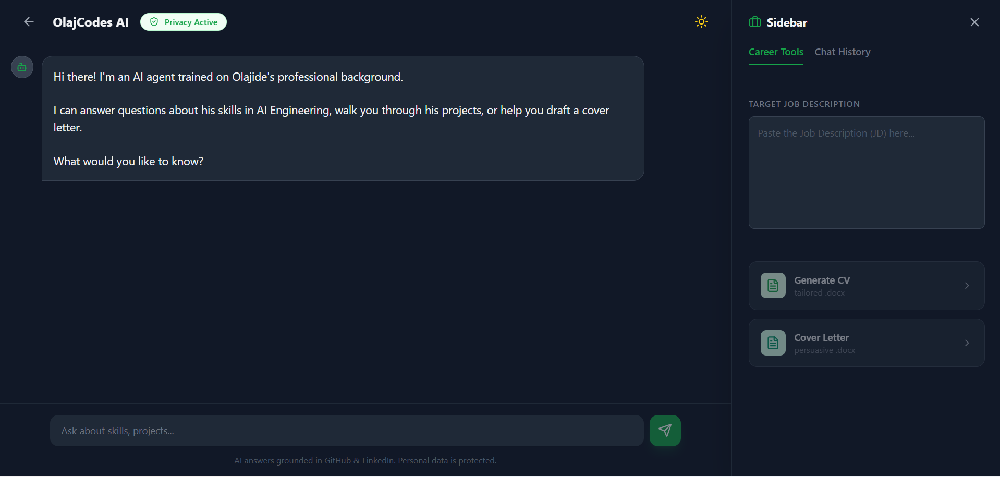

# OlajCodes AI: The Autonomous Portfolio Agent


> **"Don't just read my CV. Interview my AI agent."**

This is not a static portfolio website. It is an **autonomous RAG (Retrieval-Augmented Generation) Agent** that represents me professionally. It ingests my entire digital footprint (GitHub code, LinkedIn profile, Technical Articles), indexes it into a Vector Database, and uses it to answer recruiter questions and generate tailored documents in real-time.

---

## 🚀 Key Features

### 1. 🧠 Evidence-Based RAG Chat
Unlike generic chatbots, this agent **cannot hallucinate**.
* **Strict Grounding:** Every claim is cross-referenced with my actual data.
* **Citations:** Responses include clickable citations (e.g., `[Source: main.py]`, `[Source: Profile.pdf]`) proving I actually did the work.

### 2. 📄 Tailored Document Generation
The Recruiter Value Driver:
* **Input:** Paste any Job Description (JD).
* **Process:** The AI maps my skills to the JD requirements.
* **Output:** Instantly downloads a **Tailored CV (.docx)** and **Persuasive Cover Letter (.docx)** optimized for that specific role.

### 3. 🛡️ Intelligent Guardrails ("The Gatekeeper")
The agent acts as a professional filter:
* **Relevance Check:** If a user pastes a JD for a non-tech role (e.g., "Nurse" or "Chef"), the AI **refuses to generate documents**, explaining that the role does not align with my expertise.
* **Privacy:** It is programmed to withhold sensitive personal data (phone number, home address) unless specifically authorized.

### 4. 🎨 Modern Dual-Theme UI
* **Dynamic Theming:** Seamless toggle between a crisp **Corporate Light Mode** (White/Green) and an immersive **Developer Dark Mode** (Gray/Emerald).
* **Responsive:** Fully mobile-optimized sidebar and chat interface.

---

## 🏗️ System Architecture

The system follows a standard RAG pipeline optimized for accuracy:



  1. Ingestion: Scrapes my GitHub repos, parses my LinkedIn PDF, and reads local Markdown notes.
  
  2. Embedding: Uses text-embedding-3-small to convert text into vector space.
  
  3. Retrieval: ChromaDB performs semantic search to find relevant experience.
  
  4. Generation: GPT-4o synthesizes the answer or drafts the document using python-docx.
  
  ## 🛠️ Tech Stack
  
  **Backend (Python)**
  - FastAPI: High-performance async API framework.
  
  - LangChain: Framework for RAG logic and chain orchestration.
  
  - ChromaDB: Local vector database for context storage.
  
  - OpenAI API: LLM (GPT-4o) and Embeddings.
  
  - Python-docx: Programmatic document creation.
  
  **Frontend (React)**
  - Vite + React: Fast, modern frontend build tool.
  
  - Tailwind CSS: Utility-first styling for the custom "Green/Emerald" theme.
  
  - Lucide React: Beautiful, consistent iconography.
  
  - Fetch API: For streaming responses and file downloads.
  
  ## ⚡ Quick Start
  **Prerequisites**
  - Python 3.10+
  
  - Node.js 18+
  
  - OpenAI API Key
  
  1. Clone & Setup Backend
  ```Bash
  git clone [https://github.com/Olajcodes/personified-rag.git](https://github.com/Olajcodes/personified-rag.git)
  cd personified-rag/backend
  ```
  2. Create Virtual Env
  ```Bash
  python -m venv venv
  source venv/bin/activate  # or venv\Scripts\activate on Windows
  ```

 3. Install Dependencies
  ```Bash
  pip install -r requirements.txt
  ```

4. Set API Key
- Create a .env file and add: OPENAI_API_KEY=sk-proj-...

5. Ingest Data Before running the server, you must build the "Brain" (Vector DB).
  ```Bash
  python ingest.py
  ```
You should see: "Success! Database created."

**Run Servers**
Backend:
  ```Bash
  uvicorn main:app --reload
  ```
 Running on http://localhost:8000

Frontend:
  ```Bash
  cd ../frontend
  npm install
  npm run dev
  ```
 Running on http://localhost:5173

**The Screenshot of the Landing Page.**




**The Screenshot of the Chat Interface.**


## 📄 License

This project is proprietary and confidential.
Copyright © 2026 OlajCodes.
```